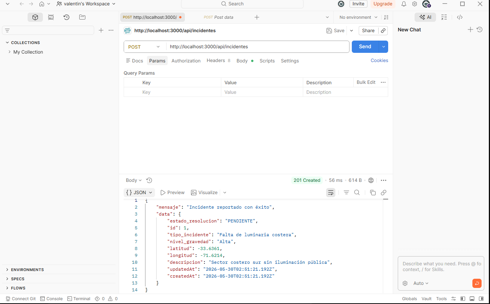
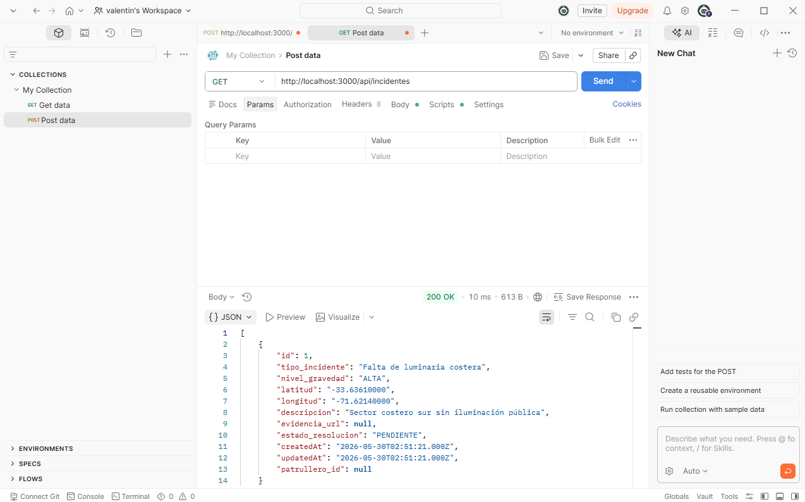

# Documentación Técnica de Consumo de API (SIGEP)

Este documento detalla los endpoints expuestos por el backend para el correcto consumo desde el frontend (Ionic + React). 

## Base URL
`http://localhost:3000/api`

---

## 1. Módulo de Incidentes (`/api/incidentes`)

### A. Registrar nuevo incidente
* **Ruta:** `/incidentes`
* **Método:** `POST`
* **Formato del Cuerpo (JSON):**
```json
{
  "tipo_incidente": "string",
  "nivel_gravedad": "string",
  "latitud": "number",
  "longitud": "number",
  "descripcion": "string"
}

Respuesta Exitosa (201 Created):

{
  "mensaje": "Incidente reportado con éxito",
  "data": {
    "id": 1,
    "tipo_incidente": "Falta de luminaria costera",
    "nivel_gravedad": "Alta",
    "latitud": -33.6361,
    "longitud": -71.6214,
    "estado_resolucion": "PENDIENTE",
    "createdAt": "2026-05-30T02:51:21.192Z"
  }
}
```


### B. Listar todos los incidentes
* **Ruta:** `/incidentes`
* **Método:** `GET`
* **Respuesta Exitosa (200 OK):** Retorna un arreglo con todos los objetos de incidentes almacenados en MySQL.

---

## 2. Módulo de Geocercas (`/api/geocercas`)

### A. Crear zona de vigilancia
* **Ruta:** `/geocercas`
* **Método:** `POST`
* **Formato del Cuerpo (JSON):**

### B. Listar geocercas
* **Ruta:** `/geocercas`
* **Método:** `GET`
* **Respuesta Exitosa (200 OK):** Retorna el listado de perímetros activos controlados por el sistema.

---

## 3. Módulo de Usuarios (`/api/usuarios`)
* **Rutas disponibles:** `/` 
  * `GET`: Para listar patrulleros.
  * `POST`: Para registrar nuevos usuarios o verificar accesos.

---

## 4. Módulo de Posiciones GPS (`/api/posiciones`)
* **Rutas disponibles:** `/`
  * `POST`: Para enviar la ubicación en tiempo real de los patrulleros en ruta.

